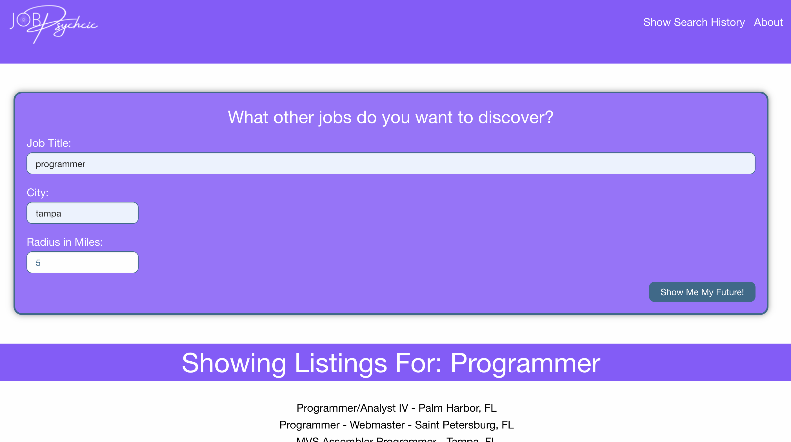

# Job Psychic

Job Search Platform for the US

## User Story

AS A potential employee in the job market
I WANT a one-stop platform to perform a job search using popular job listing platforms
SO THAT I can easily find links to job listings from mulitiple sources that open the links in a new tab on the corresponding website

## Acceptance Criteria

GIVEN a job listing search platform with form inputs for job listings
WHEN I search for a job listing
THEN I am presented with a list of job listings from multiple platforms displaying the job title and location
WHEN I click on a listing
THEN the listing is added to the search history list for retrieval later
THEN the listing opens in a new tab using the corresponding platform
WHEN I click on the job listing title in the search history
THEN I am again presented with the listing opened in a new tab
WHEN the form inputs do not come back with results due to a typing error
THEN the form displays an error message notifying the user

## Built With

* HTML
* CSS
* JavaScript
* Foundation

## Website
https://npokamestov.github.io/job-psychic/

## Screenshot

### This project is made by:

* Cristian Acevedo

* Nikita Pokamestov

* Steadman Dixon
